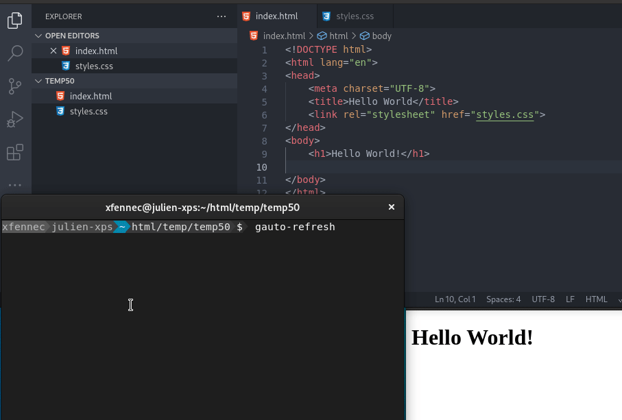

# gauto-refresh
Automatically refresh your web pages when saving files



## Install
Install go (sometimes named "golang") and then:
```sh
go install github.com/OnitiFR/gauto-refresh@latest
```

See `gauto-refresh` -h for help.

## TODO
Detect new folders and automatically add them to the watch list.
